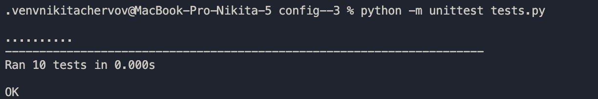

# Учебный парсер конфигурационного языка

Данный проект реализует инструмент командной строки для работы с учебным конфигурационным языком. Он выполняет преобразование входного конфигурационного текста в формате учебного языка в выходной формат TOML. Также в проекте предусмотрены тесты для проверки всех функций парсера.

## Требования

Для работы с проектом необходимо:
- Python 3.8 или выше
- Установленный `pip`

## Установка

1. Склонируйте репозиторий или загрузите проект.
   ```bash
   git clone <https://github.com/ase1lo/config--3-var26>
   cd <папка-с-проектом>
   ```

2. Создайте и активируйте виртуальное окружение:
   ```bash
   python -m venv .venv
   source .venv/bin/activate  # Для macOS/Linux
   .venv\Scripts\activate   # Для Windows
   ```

3. Установите зависимости из файла `requirements.txt`:
   ```bash
   pip install -r requirements.txt
   ```

## Использование

### Основной скрипт `main.py`

Скрипт `main.py` принимает файл с конфигурацией на вход и преобразует его в формат TOML. Вывод результата осуществляется в стандартный вывод.

#### Запуск

```bash
python main.py <input_file>
```

#### Пример

Входной файл `config_input.txt`:
```plaintext
var numbers := (1, 2, 3, 4)
var base := 10
var result := ${base 3 * 5 +}
```

Запуск:
```bash
python main.py config_input.txt
```

Результат:
```toml
[constants]
numbers = [ 1, 2, 3, 4,]
base = 10
result = 35
```

### Тестирование `tests.py`

Скрипт `tests.py` содержит юнит-тесты для проверки парсера. Тесты покрывают все конструкции конфигурационного языка, включая синтаксические ошибки, массивы, выражения и вложенные структуры.

#### Запуск тестов

```bash
python -m unittest tests.py
```

#### Пример результата тестирования



